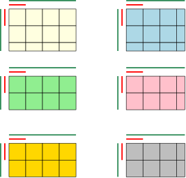

# Matrix Distribution

The matrix (also denoted global matrix) is the matrix which is distributed using a 2D block cyclic distribution scheme.
Therefore any of the rank stores in its own memory only a part the elements which are part of the local matrix.
The matrix is divided in submatrices of the same size (exceptions are ithe submatrices in the boundaries which can be smaller) called tiles.

## Global to local mapping

The global matrix of size `size` (denoted by blue lines in Fig. 1) is divided in blocks of size `block_size` (red lines).
The blocks are then distributed ciclically among the processes which are mapped in a 2D grid. In Fig. 1 there are 6 processes on a (3x2) grid.

*Fig. 1 Distribution of a matrix. Each color represent a process.*

An index is used to indicate the source rank, i.e. the rank which has the top left block of the matrix.
For example, Fig. 2 illustrates how the first (4x4) blocks are doistributed for different source rank.

*Fig. 2. Mapping of blocks and processes with different sorce rank. On the left the source rank is {0, 0}, in the center is {2, 1} and on the right is {1, 0}.*

Fig. 3 shows the local matrix of size `local_size` (green lines in Fig. 3) of each of the 6 processes.

*Fig. 3. Local matrix of each process for the matrix depicted in Fig 1.*

## Distribution constrains

The following constrains holds:
- Each tile is stored in the memory of a single rank.
- Each block of the 2D block cyclic distribution is a tile.

## Naming conventions

Strong type 2D indices and sizes are used to reduce the possibility of index mixing errors.
The following naming convention is used for the types of indices and sizes:
- `GlobalElementIndex`: index of an element in a global matrix.
- `GlobalTileIndex`: index of a tile in a global matrix.
- `LocalTileIndex`: index of a tile in a local matrix.
- `TileElementIndex`: index of ain element in a tile.
- `GlobalElementSize`: the size of a global matrix in elements.
- `LocalElementSize`: the size of a local matrix in elements.
- `GlobalTileSize`: the size of a global matrix in tiles.
- `LocalTileSize`: the size of a local matrix in tiles.
- `TileElementSize`: the size of a tile in elements.

Warning: 1D indices and sizes have all the same type.

## Index manipulation

Utilities exist to tranform global indices to local indices and viceversa.
The "Next" versions of conversions from global to local indices return the corresponding local index of the global index, if the global index is the given process,
otherwise they return the local index correnponding to the next global index in the given process.

The following table shows how a component of GlobalElementIndex tranforms for `block_size = 3`, `grid_size = 2`, `src_rank_index = 2`.

| GlobalElementIndex        |  0 |  1 |  2 |  3 |  4 |  5 |  6 |  7 |  8 |  9 | 10 | 11 | 12 | 13 | 14 | 15 |
|---------------------------|---:|---:|---:|---:|---:|---:|---:|---:|---:|---:|---:|---:|---:|---:|---:|---:|
| GlobalTileIndex           |  0 |  0 |  0 |  1 |  1 |  1 |  2 |  2 |  2 |  3 |  3 |  3 |  4 |  4 |  4 |  5 |
| CommunicatorRank          |  1 |  1 |  1 |  2 |  2 |  2 |  0 |  0 |  0 |  1 |  1 |  1 |  2 |  2 |  2 |  0 |
| LocalElementIndex Rank 0  |    |    |    |    |    |    |  0 |  1 |  2 |    |    |    |    |    |    |  3 |
| LocalElementIndex Rank 1  |  0 |  1 |  2 |    |    |    |    |    |    |  3 |  4 |  5 |    |    |    |    |
| LocalElementIndex Rank 2  |    |    |    |  0 |  1 |  2 |    |    |    |    |    |    |  3 |  4 |  5 |    |
| LocalTileIndex Rank 0     |    |    |    |    |    |    |  0 |  0 |  0 |    |    |    |    |    |    |  1 |
| LocalTileIndex Rank 1     |  0 |  0 |  0 |    |    |    |    |    |    |  1 |  1 |  1 |    |    |    |    |
| LocalTileIndex Rank 2     |    |    |    |  0 |  0 |  0 |    |    |    |    |    |    |  1 |  1 |  1 |    |
| NextLocalTileIndex Rank 0 |  0 |  0 |  0 |  0 |  0 |  0 |  0 |  0 |  0 |  1 |  1 |  1 |  1 |  1 |  1 |  1 |
| NextLocalTileIndex Rank 1 |  0 |  0 |  0 |  1 |  1 |  1 |  1 |  1 |  1 |  1 |  1 |  1 |  2 |  2 |  2 |  2 |
| NextLocalTileIndex Rank 2 |  0 |  0 |  0 |  0 |  0 |  0 |  1 |  1 |  1 |  1 |  1 |  1 |  1 |  1 |  1 |  2 |
| TileElementIndex          |  0 |  1 |  2 |  0 |  1 |  2 |  0 |  1 |  2 |  0 |  1 |  2 |  0 |  1 |  2 |  0 |

`include/dlaf/matrix/util_distribution.h` constains the functions to transform the indices for any distribution (distribution details are arguments of the functions),
while `include/dlaf/matrix/distribution.h` provides index conversion member functions for the distribution object.

# Local Matrix Layout

The layout of the matrix represent the map which gives the position in the memory of each each element of the local matrix.
It is used for compatibility with other libraries and existing applications.
The matrix layout can describe both a column-major matrix or a matrix stored in tile layout.

*Fig. 4. Left: Layout of a column major matrix. Right: Mapping of a tile layout matrix.*

*Fig. 5. Left: Layout of a column major matrix. Right: Mapping of a tile layout matrix.*

Fig. 4 and 5 show some examples of layouts. The colored and black dots represent each an element of the matrix.
The grey dots are positions in the memory which are never accessed.

The layout is described by 3 parameters which are indicated in Fig 4:
- `tile_leading_dimension`: the distance in the memory of tile element `(i,j)` and `(i,j+1)` (red line),
- `tile_row_offset`: the distance between a tile and the next row tile (blue line),
- `tile_col_offset`: the distance between a tile and the next column tile (green line).
