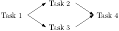
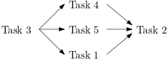
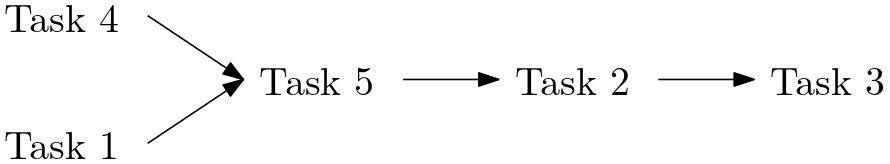

# Synchronization mechanism.

To simplify the dependency tracking during the generation of the task graph we introduced
a mechanism which generates automatically the following dependencies:
- Successive tasks that modify (write) values of a tile are ordered, therefore each write
  task depends on the previous write task.
- Successive tasks that only read values of a tile can be executed concurrently,
  however they all depend on the previous write task and the next write task depends on
  the completion of all the read tasks.

## Matrix and Matrix Tiles basics

The matrix object (`dlaf::matrix::Matrix`) is the object which manages the setup of
the correct dependencies of the tasks which involve any of its tiles.

Matrix tiles (`dlaf::matrix::Tile`) can be accessed using two matrix methods.
- `operator()` returns a `pika::future` of a tile containing the requested tile,
- `read()` returns a copy of a `pika::shared_future` of a tile with constant elements representing
  the tile (allows only read operations on tile elements).

Successive calls to `read()` with the same tile index return a copy of the same `shared_future`
if no `operator()` was invoked.

Both the `Matrix` and the `Tile` objects are not thread safe. The future mechanism ensures that
each tile is either accessed in read-write mode by only one task, or in read-only mode by more tasks.
On the other hand the user has to guarantee that a `Matrix` object is used only by one task at a time.
For asynchronous scheduling [matrix views](#matrix-views) has to be used.

### Basic Examples

(Note: these examples are used to illustrate how dependencies are determined,
however they cannot be compiled since they are simplified to improve readability
(e.g. constructors and template parameters are omitted).)

- Example 1: Write dependencies.
```cpp
  Matrix m;

  pika::dataflow(Task1, m({0, 0}));
  pika::dataflow(Task2, m({0, 0}));  // Depends on Task1.
  pika::dataflow(Task3, m({0, 1}));  // Different tile. No dependency on Task1 nor on Task2.

// Resulting dependency graph:
// Task1 - Task2
//
// Task3
```
- Example 2: Read dependencies.
```cpp
  Matrix m;

  pika::dataflow(Task1, m({0, 0}));
  pika::dataflow(Task2, m({0, 1}));                  // Different tile.
  pika::dataflow(Task3, m.read({0, 0}), m({1, 1}));  // Depends on Task1.
  pika::dataflow(Task4, m.read({0, 0}), m({0, 1}));  // Depends on Task1 and Task2. No dependency on Task3 (both only read Tile {0, 0})
  pika::dataflow(Task5, m({0, 0}));                  // Depends on Task3 and Task4.
  pika::dataflow(Task6, m.read({0, 0}));             // Depends on Task5.

// Resulting dependency graph:
// Task1 - Task3 - Task 5 - Task6
//       \       /
// Task2 - Task4
```

### Exception handling

If a task throws an exception during its execution the future returned by the asynchronous call
contains the given exception. Moreover any tile that was supposed to be written by the Task will
be invalidated and any successive call to `operator()` and `read()` will return a future containing
an exception. Note that because of C++ limitations we cannot propagate the correct exception type and
message to tiles. Therefore they will contain a generic exception.

## Matrix Views

A matrix view can be can be used to create "sub-DAG" in the global DAG of a matrix.
It gives the chance to take control of a particular asynchronous step of the matrix,
allowing to concurrently schedule the work that will be executed after the work
scheduled by the matrix view has been executed and the matrix view is notified that
all the tasks has been scheduled (`done()`, `doneWrite()`, destructor).
This is very handy, because it allows to schedule tasks inside the sub-DAG of the matrix view,
and it will be like inserting new dependencies in between two already existing ones.

A matrix view (`dlaf::matrix::MatrixView`) can be created from a `Matrix` or from another `MatrixView`,
which will be indicated as "parent matrix".
Both constant and non-constant views are available. The main difference is that `operator()`
is not allowed for constant matrices as only read-only tasks can be performed on its tiles.

When a matrix view is created each successive call of `operator()` and `read()` on the parent matrix
will return futures which depend on the tasks scheduled with the futures obtained by the matrix view.
It is possible to transfer the scheduling of all or just a subset of the tiles.
Currently it can be specified with the `uplo` parameter if:
- all the tiles or
- only the tiles which contain an element of the diagonal or the upper (lower) triangular

has to be transferred to the new view.

In this way the DAG scheduling can be performed concurrently on the parent matrix and the matrix view,
but the correct dependencies are guarenteed. An important fact to be noted is that the view needs to be
able to notify that no other tasks will be scheduled to enable the next tasks created from the parent matrix.
The `MatrixView` API contains 3 ways to accomplish that:
- the destructor notifies that no new tasks will be scheduled on any of the tile,
- `done(tile_index)` notifies that no new task will be scheduled on the tile with the given index
(After this call any use of `operator()` or `read()` with the same tile index will return an error.),
- `doneWrite(tile_index)` notifies that no new read-write task will be scheduled on the tile with the given index
(After this call any use of `operator()` with the same tile index will return an error.).

It has to be noted that read-only tasks of the parent matrix and of the view can be performed at the same time
if no read-write tasks has been scheduled in between (see [examples](#view-examples)).

### View Examples

(Note: these examples are used to illustrate how dependencies are determined,
however they cannot be compiled since they are simplified to improve readability
(e.g. constructors and template parameters are omitted).)

- Example 1: Basic view usage.
```cpp
  Matrix m;

  pika::dataflow(Task1, m({0, 0}));
  pika::dataflow(Task2, m({0, 0}));  // Depends on Task1.
  pika::dataflow(Task3, m({0, 1}));  // Different tile. No dependency on Task1 or Task2.

  {
    MatrixView mv(UpLo::General, m);
    pika::dataflow(Task4, mv({0, 0}));  // Depends on Task2.
    pika::dataflow(Task5, mv({0, 1}));  // Depends on Task3.
  }

  pika::dataflow(Task6, m({0, 0}));  // Depends on Task4.
  pika::dataflow(Task7, m({0, 1}));  // Depends on Task5.

// Resulting dependency graph:
// Task1 - Task2 - Task4 ~ Task6
//
// Task3 - Task5 ~ Task7
//
// Note the that the ~ dependencies include the call to the destructor of mv.
```
- Example 2: Basic Usage with `done()`.
```cpp
  Matrix m;

  pika::dataflow(Task1, m({0, 0}));
  pika::dataflow(Task2, m({0, 0}));  // Depends on Task1.
  pika::dataflow(Task3, m({0, 1}));  // Different tile. No dependency on Task1 or Task2.

  MatrixView mv(UpLo::General, m);

  pika::dataflow(Task4, m({0, 0}));   // Depends on done notification and Task6
  pika::dataflow(Task5, m({0, 1}));   // Depends on done notification and Task7
  pika::dataflow(Task6, mv({0, 0}));  // Depends on Task2.
  pika::dataflow(Task7, mv({0, 1}));  // Depends on Task3.

  mv.done({0, 0});
  mv.done({0, 1});

// Resulting dependency graph:
// Task1 - Task2 - Task6 ~ Task4
//
// Task3 - Task7 ~ Task5
//
// Note the that the ~ dependencies include the dependency on the call to done().
```
- Example 3: Read concurrency.
```cpp
  Matrix m;

  pika::dataflow(Task1, m({0, 0}));
  pika::dataflow(Task2, m.read({0, 0}));  // Depends on Task1

  MatrixView mv(UpLo::General, m);

  pika::dataflow(Task3, m.read({0, 0}));   // Depends on doneWrite notification and Task5
  pika::dataflow(Task4, mv.read({0, 0}));  // Depends on Task2.
  pika::dataflow(Task5, mv({0, 0}));       // Depends on Task2 and Task4.

  mv.doneWrite({0, 0});

  pika::dataflow(Task6, mv.read({0, 0}));  // Depends on Task5.

  mv.done({0, 0});

  pika::dataflow(Task7, m.read({0, 0}));  // Depends on doneWrite notification and Task5
  pika::dataflow(Task8, m({0, 0}));       // Depends on done notification and Task3,6,7

// Resulting dependency graph:
// Task1 - Task2 - Task5 -  Task6 -= Task8
//       \ Task4 /       \~ Task3 /
//                       \~ Task7 /
//
// Note the that the \~ dependencies include the dependency on the call to doneWrite().
// Note the that the -= dependencies include the dependency on the call to done().
```

## Matrix and Matrix Tiles advanced: Tile dependencies mechanism

The dependency are managed with a promise-future mechanism.

When the destructor of a tile obtained with `operator()` or `read()` is called, the value
of the next future is set using the promise which was assigned by the `Matrix` object.
Note that the destructor of the tile contained in the shared future is only called when all
instances of the shared futures go out of scope, therefore,
to avoid deadlocks the scope of tile shared futures needs extra care.

Note that returning matrix tiles from tasks may be a source of deadlocks,
therefore it should be avoided if possible. Otherwise a carefull analysis of the dependencies is needed to avoid problems.

### Examples advanced use

(Note: these examples are used to illustrate how dependencies are determined,
however they cannot be compiled since they are simplified to improve readability
(e.g. constructors and template parameters are omitted).)

- Example 1: Returning Tiles.
```cpp
Tile&& Task1(pika::future<Tile>&& future) {
  auto tile = future.get();
  // Do some work

  return std::move(tile);
}

  Matrix m;

  auto future1 = pika::dataflow(Task1, m({0, 0}));
  pika::dataflow(Task2, m.read({0, 0}));  // Depends on Task3 (The Tile used in Task1 is still available in future1).

  pika::dataflow(Task3, future1);  // Depends on Task1.

// Resulting dependency graph:
// Task1 - Task3 - Task2
```
- Example 2: Deadlock returning Tiles.
```cpp
Tile&& Task1(pika::future<Tile>&& future) {
  auto tile = future.get();
  // Do some work

  return std::move(tile);
}

  Matrix m;

  auto future1 = pika::dataflow(Task1, m({0, 0}));
  pika::dataflow(Task2, future1, m.read({0, 0}));
  // DEADLOCK:
  // This task depends on Task1 (via future1), and on the destruction of the Tile in future1 (read()).
  // The scope of the Tile in future1 is extended to the end of Task2, and therefore the execution
  // of Task2, and therefore of the destructor of future1 tile, depends on the execution of itself.
```
- Example 3: Deadlock returning Tiles (2).
```cpp
Tile&& Task1(pika::future<Tile>&& future) {
  auto tile = future.get();
  // Do some work

  return std::move(tile);
}

  Matrix m;

  auto future1 = pika::dataflow(Task1, m({0, 0}));
  auto future2 = pika::dataflow(Task2, m.read({0, 0}));  // Depends on Task3 (The Tile used in Task1 is still available in future1).

  future2.get();  // DEADLOCK! Task2 is not ready yet, and cannot get ready because the destructor of the Tile in future1 will not be called.

  pika::dataflow(Task3, future1);  // Depends on Task1.
```
- Example 4: Deadlock shared future scope.
```cpp
  Matrix m;

  pika::dataflow(Task1, m({0, 0}));
  auto shared_future = matrix.read({0, 0});
  pika::dataflow(Task2, shared_future);   // Depends on Task1.
  pika::dataflow(Task3, m.read({0, 0}));  // Depends on Task1.

  auto future4 = pika::dataflow(Task4, m({0, 0}));  // Depends on Task2 and Task3.

  future4.get();  // DEADLOCK! Task4 is not ready yet, and cannot get ready because the destructor of the Tile in shared_future will not be called.
```
- Example 4 fixed: Deadlock shared future scope.
```cpp
  Matrix m;

  pika::dataflow(Task1, m({0, 0}));

  {
  auto shared_future = matrix.read({0, 0});
  pika::dataflow(Task2, shared_future);   // Depends on Task1.
  pika::dataflow(Task3, m.read({0, 0}));  // Depends on Task1.
  }  // shared_future goes out of scope here.

  auto future4 = pika::dataflow(Task4, m({0, 0}));  // Depends on Task2 and Task3.

  future4.get();  // Task4 may not be ready yet, but it will get ready after the completion of Task4.
```

## Implementation details

To simplify the understanding of the dependencies mechanism we explain it for simple cases and we will add
other features one by one.

### Matrix mechanism
The simplest case includes constant matrices with read-only tiles. In this case only a shared future
for each tile is needed which is returned by the `read()` method.

The next case to be considered is a matrix for which read-only access is not needed.
For this specific case a future for each tile is needed. This future is an "internal" future
since the promise of the tile is not set yet.
When the `operator()` is called a promise is injected into the future with a synchronous continuation
(i.e. a continuation which is executed as soon as the future gets ready) and the future of the promise
is kept by the matrix.

In the general case when the `read()` method has to be available as well a future and a
shared future are needed for each tile.
The usage of the future is the same as in the previous case, with an extra operation: A call to `operator()`
has to invalidate the shared future (It sets it to a default constructed object (red line with cross in the image)),
such that when all the tasks complete no copies of the shared future remain and the destructor of the tile is called.
On the other hand the shared future is the main change to handle the read-only case.
A call to `read()` first checks if the shared future is valid. If it is not it means that
a read-write operation was scheduled before and the shared future has to be constructed.
The mechanism is similar to the one used in `operator()` with the only difference that
the future contains a tile with constant element and it is transformed in a shared future.
A copy of the shared future is stored in the matrix for successive call to `read()` which simply return
the stored object.
Figure 1 shows how the mechanism works, while Figure 2 contains the legend of the notation used.

\
\
\
*Fig. 1 Graphical representation of the promise-future mechanism for a tile of the matrix object.*

\
*Fig. 2 Legend for Figure 1, 3, 4.*

### Async Exceptions

To ensure correct exception handling, the tile destructor sets the promise value if it was called during normal execution,
otherwise it sets a custom exception when it is called after an exception has been thrown.
In the latter case, the call to `get()` in the continuation will rethrow the exception,
the promise will be destructed and the new future stored in the matrix will have an invalid shared state.
Therefore the continuations in `operator()` and `read()` have to handle it.

### Matrix View

`MatrixView<const T>` can be handled in a simple way. On construction it only needs to call the `read()`
method of the parent matrix to get a copy of the shared future, which is saved internally and it will be returned
each time it is used (`read()`). To release the view, the `done()` method just clears the shared future of the view.

Non constant `MatrixView<T>` requires a more complex handling mechanism.
On construction the two futures (future and shared future) of the parent matrix are moved in the view and
replaced by futures of the promises also stored in the view. This is important because

- on one side, the matrix view becomes the natural continuation of the parent matrix in the exact point in the DAG where we created it;
- on the other side it detaches the main DAG, allowing to schedule tasks in the sub-DAG,
but keeping track of where the flow has to go when the matrix view will be marked as `done()`/`doneWrite()`.

For what concerns the `operator()` and `read()`, the matrix view works exactly as the matrix.

The new part comes when we have to deal with the extra features of the matrix view: `doneWrite()` and `done()`.
These methods are the ones that allow to go back to the normal flow that was detached on construction.

We have to keep in mind two things:
- we have to attach back two lines, future (RW) and shared future (R) in the parent matrix
- with a call to `doneWrite()`, the matrix view should be able to continue get the read-access,
but at the same time also the parent matrix should be able to read in parallel
(since no other changes can be made by the subDAG of the matrix view).

In order to achieve this, there is a articulated machinery that allows to finely control this re-attachment to the normal flow.

A call to `doneWrite()` internally performs a `read()` operation, this will be the last shared future in the sub-DAG,
and it will be the one that will be returned by any next call to `read()` on the matrix view.
Then, a synchronous continuation task is attached to a copy of the shared future.
This task will create a copy (a copy of the reference, the elements are not copied)
of the tile (`Tile<const T>`) as soon as the `shared_future` is ready.
The copy is used to set the value of the shared future of the parent matrix.
This is what allows to have both the matrix view and the parent matrix to access in read-only mode the tile in parallel.
However, it has to be noted that a promise cannot be copied, therefore the copy will get a new promise.
(The copy with a new promise is represented in Figure 3 and 4
with the purple (copy) and red (move of the new promise) arrows pointing to the light yellow promise.)

The crucial point of the machinery is the correct handling of the next dependency
that has to manage the synchronization of both the shared future of the matrix view and of the parent matrix.
A synchronous dataflow, which sets the value of the internal future (light green future in Figure 3 and 4)
of the parent matrix, is used in this case, whose arguments are two futures:
- the tile in the original shared future of the matrix view (orange) has internally a promise
  (purple promise) that triggers the first future of the dataflow,
- the copied tile (contained in the light yellow shared future)
  is given another promise (blue promise) that will set the second future.

This dataflow provides a way to lock the future write accesses from the parent matrix.
In fact, the synchronization task that will attach back the future of the parent matrix, is triggered by both of them.
So if the matrix view releases all shared futures, the mechanism has to wait that all the shared futures
of the parent matrix are released too, and viceversa.

It should be noted that the `done()` method invokes `doneWrite()` if the tile is still in read-write mode,
i.e. when `doneWrite()` hasn't be called yet. Figure 3 and 4 show how a non-constant matrix view works.

\
\
\
*Fig. 3 First example of the matrix view promise-future mechanism for a tile of the matrix object.*

\
\
\
*Fig. 4 Second example of the matrix view promise-future mechanism for a tile of the matrix object.*
